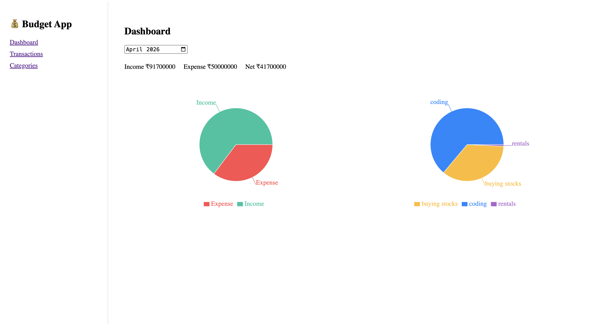
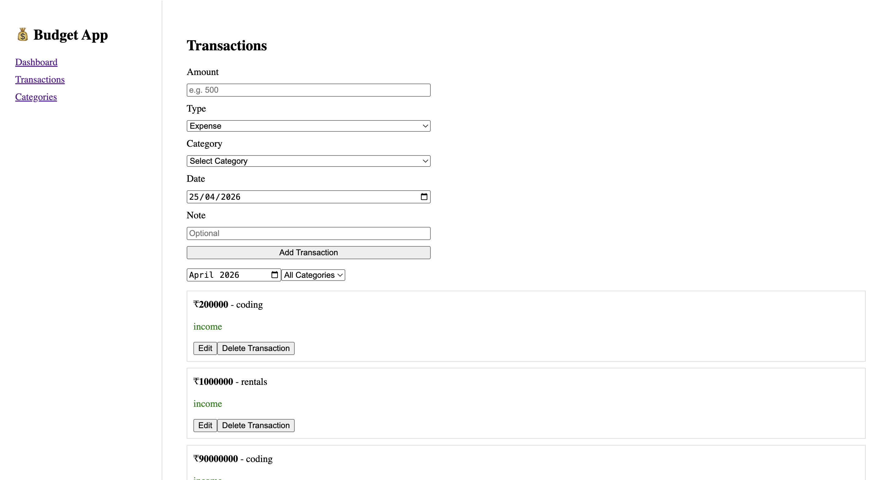

# 💰 Budget Tracker

A full-stack personal finance tracker built using the MERN stack.  
Track your income and expenses, manage categories, and visualize spending patterns.

---

## 🎯 Problem

People often find it difficult to track their daily income and expenses, leading to poor financial awareness.

---

## 💡 Solution

A web application that allows users to record, manage, and analyze their financial transactions in a simple and visual way.

---

## 🧱 MVP Features

- User authentication (Signup/Login)
- Add income and expense transactions
- View transactions list
- Dashboard showing balance (income vs expense)

---

## 🚀 Current Features (Extended)

- 🔐 JWT Authentication
- 🗂 Category management (Income / Expense)
- 💸 Add, edit, delete transactions
- 📅 Monthly filtering
- 📊 Dashboard with charts
- 📈 Category-wise breakdown (Pie charts)
- ⚡ Responsive UI

---

## 🛠 Tech Stack

**Frontend**
- React
- Axios
- Recharts

**Backend**
- Node.js
- Express.js

**Database**
- MongoDB (Mongoose)

**Security**
- JWT Authentication
- Helmet
- Rate Limiting
- CORS Protection

---

## 📦 Project Structure
Budget-Tracker/
├── client/ # React frontend
├── server/ # Express backend

---

## ⚙️ Setup Instructions

### 1. Clone the repo
git clone https://github.com/pedakantimanojkumar/Budget-Tracker.git

cd Budget-Tracker

---

### 2. Setup Backend
cd server

npm install

Create a `.env` file:
PORT=5000
MONGO_URI=your_mongodb_connection_string
JWT_SECRET=your_jwt_secret

Run backend:
npm run dev

---

### 3. Setup Frontend
cd client

npm install

npm run dev

---

## 🔐 Environment Variables
PORT=5000
MONGO_URI=your_mongodb_connection_string
JWT_SECRET=your_jwt_secret

---

## 📊 Future Improvements

- Pagination for transactions
- Budget limits per category
- Notifications
- Export reports (PDF/CSV)
- Deployment (Vercel + Render)

---
## 📸 Screenshots

### Dashboard

### Transactions

### Categories

## 👨‍💻 Author

Manoj Kumar Reddy

